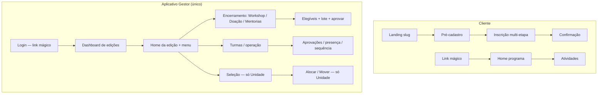

# Protótipo — Interfaces do Sistema Consulado da Mulher

Documentação de telas para **Fase 1 (Prototipação)** do contrato EWTI × Consulado da Mulher.

**Fontes:** [Casos de Uso v7](../Casos%20de%20Uso%20-%20Consulado%20da%20Mulher_v7.md), [Design.md](../Design.md)

---

## Convenções

| Campo | Descrição |
| ----- | --------- |
| **Rota** | URL sugerida (Next.js App Router) |
| **Perfil** | Quem acessa a tela |
| **UCs** | Casos de uso relacionados |
| **Prioridade** | MVP (edições 2027) ou Fase 3 |

**Plataformas:** mobile-first, web responsivo.

Documentos consolidados (fonte de verdade dos menus/papéis):

- **[Aplicativo Gestor.md](Aplicativo%20Gestor.md)** — app **único** Unidade + Turma (tela unificada)
- [Aplicativo Cliente.md](Aplicativo%20Cliente.md)

> Os arquivos [Aplicativo Gestor de Unidade.md](Aplicativo%20Gestor%20de%20Unidade.md) e [Aplicativo Gestor de Turma.md](Aplicativo%20Gestor%20de%20Turma.md) são **stubs** que redirecionam ao documento unificado.

---

## Aplicativo Cliente (Empreendedora)

Autenticação exclusiva por **link mágico** (sem senha). Acesso público apenas nas telas de inscrição (slug).

| # | Arquivo | Tela | UCs |
| - | ------- | ---- | --- |
| 00 | [00-componentes-globais.md](aplicativo-cliente/00-componentes-globais.md) | Componentes transversais | UC72 |
| 01 | [01-landing-edicao.md](aplicativo-cliente/01-landing-edicao.md) | Landing da edição (slug) | UC19, UC67 |
| 02 | [02-termos-consentimentos.md](aplicativo-cliente/02-termos-consentimentos.md) | Termos e consentimentos | UC20 |
| 03 | [03-pre-cadastro.md](aplicativo-cliente/03-pre-cadastro.md) | Pré-cadastro | UC19 |
| 04 | [04-inscricao-dados-pessoais.md](aplicativo-cliente/04-inscricao-dados-pessoais.md) | Inscrição — dados pessoais | UC21, UC22 |
| 05 | [05-inscricao-dados-financeiros.md](aplicativo-cliente/05-inscricao-dados-financeiros.md) | Inscrição — dados financeiros | UC21 |
| 06 | [06-inscricao-dados-programa.md](aplicativo-cliente/06-inscricao-dados-programa.md) | Inscrição — dados do programa | UC21 |
| 07 | [07-inscricao-confirmacao.md](aplicativo-cliente/07-inscricao-confirmacao.md) | Confirmação de inscrição | UC21 |
| 08 | [08-login-link-magico.md](aplicativo-cliente/08-login-link-magico.md) | Entrada por link mágico | UC4 |
| 09 | [09-home-programa.md](aplicativo-cliente/09-home-programa.md) | Home — programa e módulos | UC36 |
| 10 | [10-calendario-atividades.md](aplicativo-cliente/10-calendario-atividades.md) | Calendário de atividades | UC68 |
| 11 | [11-atividade-videoaula.md](aplicativo-cliente/11-atividade-videoaula.md) | Videoaula (YouTube) | UC37 |
| 12 | [12-atividade-aula-ao-vivo.md](aplicativo-cliente/12-atividade-aula-ao-vivo.md) | Aula (P/H) / Live encerramento (online) | UC38 |
| 13 | [13-atividade-questionario.md](aplicativo-cliente/13-atividade-questionario.md) | Questionário (módulo) | UC39 |
| 13b | [13b-questionario-final-doacao.md](aplicativo-cliente/13b-questionario-final-doacao.md) | Questionário final 100% (online) | UC39, UC38 |
| 14 | [14-atividade-presenca-qrcode.md](aplicativo-cliente/14-atividade-presenca-qrcode.md) | Presença via QR Code | UC40 |
| 15 | [15-atividade-tarefa-casa.md](aplicativo-cliente/15-atividade-tarefa-casa.md) | Tarefa de casa (upload) | UC43 |
| 16 | [16-atividade-dados-financeiros.md](aplicativo-cliente/16-atividade-dados-financeiros.md) | Dados financeiros mensais | UC45 |
| 17 | [17-atividade-indicadores.md](aplicativo-cliente/17-atividade-indicadores.md) | Indicadores (via questionário) | UC39 |
| 18 | [18-atividade-pesquisa-satisfacao.md](aplicativo-cliente/18-atividade-pesquisa-satisfacao.md) | Pesquisa NPS / satisfação | UC39 |
| 19 | [19-atividade-download.md](aplicativo-cliente/19-atividade-download.md) | Download de ferramenta | UC36 |
| 20 | [20-atividade-link-externo.md](aplicativo-cliente/20-atividade-link-externo.md) | Link externo | UC36 |
| 21 | [21-meu-perfil.md](aplicativo-cliente/21-meu-perfil.md) | Meu perfil | UC27 |
| 22 | [22-meu-historico.md](aplicativo-cliente/22-meu-historico.md) | Meu histórico | UC28 |
| 23 | [23-certificados.md](aplicativo-cliente/23-certificados.md) | Certificados | UC63 |
| 24 | [24-cancelamento-desistencia.md](aplicativo-cliente/24-cancelamento-desistencia.md) | Cancelamento / desistência | UC30 / UC79 |
| 25 | [25-chat-duvidas.md](aplicativo-cliente/25-chat-duvidas.md) | Chat de dúvidas (IA) | UC64 |
| 26 | [26-presenca-palavra-chave.md](aplicativo-cliente/26-presenca-palavra-chave.md) | Presença KW pós-live (online) | UC38 |
| 27 | [27-doacao-pix-recibo.md](aplicativo-cliente/27-doacao-pix-recibo.md) | PIX / recibo / confirmação recebimento | UC86 |

---

## Aplicativo Gestor (unificado)

Autenticação por **link mágico** (só e-mail). **Um app**, dois perfis: Unidade **inclui** todas as capacidades de Turma. Primeira tela = **Dashboard de edições**; ao abrir uma edição, carrega o menu operacional do perfil. Ver [Aplicativo Gestor.md](Aplicativo%20Gestor.md).

Arquivos granulares (legado / detalhamento por tela) permanecem em `aplicativo-gestor/` e devem ser lidos sob a regra do documento unificado:

### Comum

| # | Arquivo | Tela | UCs |
| - | ------- | ---- | --- |
| 01 | [01-login.md](aplicativo-gestor/comum/01-login.md) | Login | UC3 |
| 02 | [02-layout-navegacao.md](aplicativo-gestor/comum/02-layout-navegacao.md) | Layout e navegação | — |

### Capacidade Unidade (também no app unificado)

| # | Arquivo | Tela | UCs |
| - | ------- | ---- | --- |
| 01 | [01-dashboard-unidade.md](aplicativo-gestor/gestor-unidade/01-dashboard-unidade.md) | Dashboard (escopo unidade) | UC59* |
| 02 | [02-selecao-participantes.md](aplicativo-gestor/gestor-unidade/02-selecao-participantes.md) | Seleção | UC24 |
| 03 | [03-comunicar-selecao.md](aplicativo-gestor/gestor-unidade/03-comunicar-selecao.md) | Comunicar seleção | UC25 |
| 04 | [04-historico-participacao.md](aplicativo-gestor/gestor-unidade/04-historico-participacao.md) | Histórico | UC28 |
| 05 | [05-ranking-engajamento.md](aplicativo-gestor/gestor-unidade/05-ranking-engajamento.md) | Ranking | UC56 |
| 06 | [06-aprovar-doacao.md](aplicativo-gestor/gestor-unidade/06-aprovar-doacao.md) | Doação — processos (**só Unidade**; APROVAR) | UC57, UC85, UC86 |
| — | [doacao-processo-unificado.md](doacao-processo-unificado.md) | Portão vs processo; sugestão no negócio; aprovação Unidade | UC57, UC86 |
| 07 | [07-capital-semente.md](aplicativo-gestor/gestor-unidade/07-capital-semente.md) | Parecer capital semente (≠ UC57) | UC58 |
| 08 | [08-registrar-mentoria.md](aplicativo-gestor/gestor-unidade/08-registrar-mentoria.md) | Gestão de Mentorias | UC70 |
| 09 | [09-workshop-encerramento.md](aplicativo-gestor/gestor-unidade/09-workshop-encerramento.md) | Live + Funil (**só online**) | UC38 |
| 10 | [10-alertas-automaticos.md](aplicativo-gestor/gestor-unidade/10-alertas-automaticos.md) | Alertas automáticos (binding) | UC87 |
| 11 | [11-notas-fiscais.md](aplicativo-gestor/gestor-unidade/11-notas-fiscais.md) | NF 1:N doações (material) | UC86 |
| 12 | [12-modulo-encerramento-ph.md](aplicativo-gestor/gestor-unidade/12-modulo-encerramento-ph.md) | Módulo encerramento P/H (carga) | UC15, UC34 |
| — | [encerramento-doacao-mentoria.md](aplicativo-gestor/encerramento-doacao-mentoria.md) | **Pacote:** doação Online × P/H + NF + recibo | UC38, UC57, UC86, UC70 |

> **Doação:** portão P/H (qualquer momento) vs online (funil 100%→live→KW→quiz 100%). Processo unificado: sugerir no empreendimento; Unidade aprova em `/doacao` (digitar **APROVAR**). Cliente só após aprovada. Material: NF 1:N no Gestor; recibo após confirmação de recebimento no Cliente. Canônico: [doacao-processo-unificado.md](doacao-processo-unificado.md).

### CMS de Administração

| # | Arquivo | Tela | UCs |
| - | ------- | ---- | --- |
| 01 | [01-alertas-automacoes.md](cms/01-alertas-automacoes.md) | Comunicação — aba Alertas (UC87) | UC87, UC52, UC88 |
| 02 | [02-modulo-aula-evento.md](cms/02-modulo-aula-evento.md) | Módulo — cadastro de Aula (natureza original) | UC15 |
| 03 | [03-comunicacao-templates.md](cms/03-comunicacao-templates.md) | Comunicação — pacotes de templates (jornada P/H e online) | UC88, UC9, UC33, UC50 |

### Capacidade Turma (também disponível ao Gestor de Unidade)

| # | Arquivo | Tela | UCs |
| - | ------- | ---- | --- |
| 01 | [01-dashboard-turma.md](aplicativo-gestor/gestor-turma/01-dashboard-turma.md) | Dashboard (escopo turma) | — |
| 02 | [02-turmas-lista.md](aplicativo-gestor/gestor-turma/02-turmas-lista.md) | Lista de turmas | UC16 |
| 03 | [03-turma-detalhe.md](aplicativo-gestor/gestor-turma/03-turma-detalhe.md) | Detalhe da turma | UC16, UC17 |
| 04 | [04-alocar-participantes.md](aplicativo-gestor/gestor-turma/04-alocar-participantes.md) | Alocar (só Unidade) | UC17 |
| 05 | [05-transferir-turma.md](aplicativo-gestor/gestor-turma/05-transferir-turma.md) | Mover (só Unidade) | UC18 |
| 06–18 | demais em `gestor-turma/` | Participantes, negócios, sequência, presença, aprovações, WhatsApp, CRM | UC27–UC51, UC26 |
| 19 | [19-aula-unificada.md](aplicativo-gestor/gestor-turma/19-aula-unificada.md) | Aula presencial e ao vivo no mesmo módulo | UC15, UC34, UC35, UC40, UC41, UC50 |

\* Visão resumida; dashboard completo no Painel BI.

---

## Fluxo de navegação (resumo)

