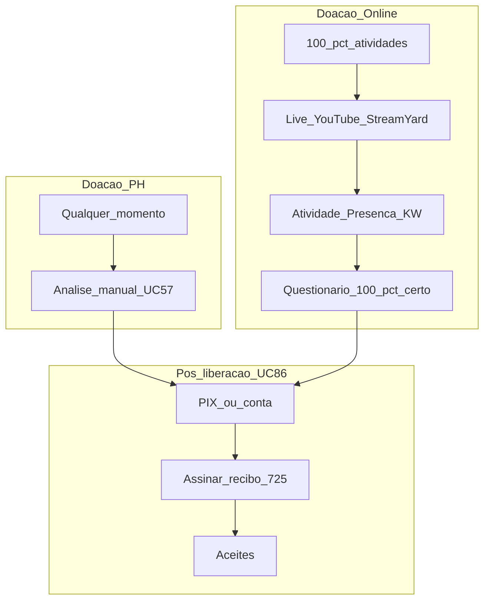

# Encerramento e doação — P/H × online (telas Gestor)

**Para:** implementar no protótipo do **Aplicativo Gestor** (Lovable / wireframes).  
**Fonte:** [Casos de Uso v7](../../Casos%20de%20Uso%20-%20Consulado%20da%20Mulher_v7.md) — doação por modalidade (canônico ago/2026).  
**Consolidado:** [Aplicativo Gestor.md](../Aplicativo%20Gestor.md)

**Canônico:** [doacao-processo-unificado.md](../doacao-processo-unificado.md). Portão diferente; processo igual. **Sugerir** no empreendimento; **aprovar só Unidade** em `/doacao` (digitar APROVAR).



| Modalidade | Gatilho | Quando |
| ---------- | ------- | ------ |
| **P/H** | Análise **manual** do gestor (sugerir/aprovar UC57; individual ou **massa**) | **Qualquer momento** do programa |
| **Online** | Funil: **100% atividades** → live (YouTube+StreamYard) → **presença/KW** → questionário **100% certo** (UC38) | Só ao fim do funil |

**Pós-liberação (comum):** PIX/conta → recibo (conta **725**; dinheiro antes / produto após) → aceites (UC86). Endereço com **ponto de referência** se material.

Filtros A–D / lote (UC14/UC85) = **auxiliares** (ex. carência 3 anos). Ranking pós-elegibilidade ≠ régua UC12.

---

## Menu (Doação = só Unidade)

Menu muda com a **modalidade da edição**. Turma **não** vê o bloco Doação.

### Edição presencial / híbrido

```
── Doação ────────────────────  ← só Unidade
Processos / totalizadores     ← aprovar com APROVAR
Recibo / PIX / Aceites        ← pós-aprovação (UC86)
Notas fiscais                 ← NF 1:N (material)
Mentorias                     ← Unidade (opcional)
```

Módulo Encerramento (carga) → na **grade de Módulos**, não neste menu.

### Edição online

```
── Encerramento online ───────
Live de encerramento          ← só quem fez 100%
Acompanhamento do funil       ← KW + questionário 100%
── Doação ────────────────────  ← só Unidade
Processos / totalizadores     ← só liberadas; APROVAR
Recibo / PIX / Aceites
Notas fiscais                 ← NF 1:N (material)
[ Lote auxiliar ]             ← opcional (carência etc.)
Mentorias
```

Rotas:

| Tela | Rota | Modalidade |
| ---- | ---- | ---------- |
| Live de encerramento | `/gestor/e/[edicaoId]/encerramento/live` | Online |
| Funil (acompanhamento) | `/gestor/e/[edicaoId]/encerramento/funil` | Online |
| Doação | `/gestor/e/[edicaoId]/doacao` | Ambas |
| Recibo / PIX / Aceites | `/gestor/e/[edicaoId]/doacao/recibo` | Ambas |
| Notas fiscais | `/gestor/e/[edicaoId]/doacao/notas-fiscais` | Ambas (material) |
| Mentorias | `/gestor/e/[edicaoId]/mentorias` | Ambas |

---

## 1. Doação — painel de processos (UC57, só Unidade)

| Campo | Valor |
| ----- | ----- |
| **Perfil** | **Só Unidade** (Turma sugere no empreendimento) |
| **Quando** | P/H: qualquer momento · Online: só *liberadas* |
| **Não exige nesta tela** | Live, palavra-chave, questionário 100% (isso é o **portão** online, em Encerramento) |
| **Tela canônica** | [06-aprovar-doacao.md](gestor-unidade/06-aprovar-doacao.md) |

Processo **inicia no empreendimento** — **sem** aprovar ali. Esta tela lista, totaliza e aprova com **digitação de APROVAR**. **1 doação por empreendimento.** Mesmo chrome em P/H e online.

### Wireframe — painel

```
┌──────────────────────────────────────────────────┐
│ Doação — processos              (só Unidade)     │
│ Abas: [ Processos ] [ Recibo ] [ NF ]            │
│ Sugeridas   CS 4 · R$ 6.000  | Mat. 2 · R$ 3.200 │
│ Aprovadas   CS 8 · R$ 12.000 | Mat. 3 · R$ 4.500 │
│ Consumido   R$ 16.500 / R$ 40.000  (teto CMS)    │
├──────────────────────────────────────────────────┤
│ Doces da Maria · Dinheiro · R$ 1.500 · Sugerida  │
│   [ Aprovar… ] [ Recusar ]  ← pop-up + APROVAR   │
│ Cooperativa · Material · R$ 2.000 · Aprovada     │
│ ℹ Elegível ≠ garantia · sugerida não consome teto│
└──────────────────────────────────────────────────┘
```

### Regras

- **Sugeridas** por tipo (qtd + R$, só `sugerida`). **Aprovadas** após digitação de APROVAR, com ou sem recibo.
- **Consumido** = soma em R$ das aprovadas / **teto único** CMS (UC9). Sugeridas não entram. Sem teto: aviso, operação segue. Estouro: aviso no pop-up; Unidade pode seguir.
- Carência D (UC14) pode bloquear; demais A–B do Workshop antigo **não** se aplicam.
- Após aprovar → UC86.

---

## 2. Encerramento online — funil (UC38)

| Campo | Valor |
| ----- | ----- |
| **Perfil** | Unidade configura e acompanha; Turma consulta |
| **UCs** | UC38, UC39 |
| **Base de convite** | **Somente 100%** das atividades |

### O que o gestor faz

1. Confirma base = quem concluiu **100%** (sem opção de % menor para doação).
2. Configura live **YouTube + StreamYard** (fora da plataforma) e dispara convite (e-mail preferencial).
3. Define **palavra-chave** (1 KW no fim; case/acento-insensitive) e **prazo rígido** pós-live.
4. Após a live, o sistema libera a **atividade de presença** no Cliente; acompanha timestamps.
5. Acompanha questionário final (só após KW válida): só **100% certo** → status **liberada para doação**.

### Wireframe — configurar live

```
┌──────────────────────────────────────────────────┐
│ Encerramento online — Live                       │
│ Edição Empreende no Zap 2027                     │
├──────────────────────────────────────────────────┤
│ 1. Base de convite                               │
│    Conclusão exigida: 100% das atividades        │
│    Convidáveis agora: 28                         │
│    [ Ver lista ]                                 │
├──────────────────────────────────────────────────┤
│ 2. Live (YouTube + StreamYard — fora da plataforma)│
│    Data * [__/__/____]  Hora * [__:__]           │
│    Link YouTube * [________________]             │
│    [ Enviar convite por e-mail ]                 │
├──────────────────────────────────────────────────┤
│ 3. Presença / palavra-chave (pós-live)           │
│    Palavra-chave * [____________]                │
│    Prazo KW+quiz * [__/__/____ __:__]            │
│    Validação: case/acento-insensitive            │
│    Status: ( ) Oculta  (•) Liberar após live     │
├──────────────────────────────────────────────────┤
│ 4. Questionário final                            │
│    Liberação para doação: 100% de acertos        │
│    [ Ver acompanhamento do funil ]               │
│ [ Salvar ]                                       │
└──────────────────────────────────────────────────┘
```

### Wireframe — acompanhamento do funil

```
┌──────────────────────────────────────────────────┐
│ Funil online — acompanhamento                    │
│ 100% atividades 28 · Live 25 · KW 22 · Quiz OK 18│
│ Filtro: [ Sem KW ▼ ] [ Quiz incompleto ▼ ]       │
├──────────────────────────────────────────────────┤
│ Nome         100%  Live  KW   Quiz   Liberada?   │
│ Maria Silva  ✓     ✓     ✓    100%   Sim         │
│ Ana Costa    ✓     ✓     ✓     80%   Não         │
│ Joana Lima   ✓     ✓     ✗     —     Não         │
│ Paula Dias   ✗     —     —     —     Não (sem 100%)│
├──────────────────────────────────────────────────┤
│ [ Exportar CSV ]  [ Ir para Doação ]             │
│ ℹ Só "Liberada = Sim" entra em Sugerir/Aprovar   │
│ ℹ Timestamp KW/quiz → ranking pós-elegibilidade  │
└──────────────────────────────────────────────────┘
```

### Regras online

- Sem **100% atividades** → não convida / não entra na live.
- Live **fora** da plataforma (YouTube + StreamYard).
- Pós-live: **atividade de presença** → KW → só então o quiz; prazo rígido; timestamp.
- Questionário: **só 100% certo** libera para doação (não basta nota parcial).
- Funil **não** concede a doação sozinho — UC57 ainda registra a concessão (incl. **massa**); UC86 é o recebimento.
- Múltiplas KW ao longo da live = **em discussão** (não canônico).

---

## 3. Doação online — mesmo painel, só liberadas

Não há tela própria de “Sugerir/Aprovar”. Usa [06-aprovar-doacao.md](gestor-unidade/06-aprovar-doacao.md) filtrada a empreendimentos *liberada para doação*. Funil permanece no §2. **Ir para Doação** no funil abre o painel Unidade.

Lote auxiliar (UC85) opcional — **não** substitui o funil nem aprova.

---

## 4. Pós-aprovação — PIX / recibo / NF (UC86 + 24/08)

Após **aprovação da doação** (Unidade, pop-up + digitar **APROVAR**). Cliente: [27-doacao-pix-recibo.md](../aplicativo-cliente/27-doacao-pix-recibo.md). NF Gestor: [11-notas-fiscais.md](gestor-unidade/11-notas-fiscais.md).

**Copy:** liberada/elegível/aprovada ≠ garantia. Cliente vê **“aguarde orientações da educadora”** — **sem** datas de pagamento.

### Dinheiro (capital semente)

1. Nome/CPF readonly + conta formal + PIX  
2. Aceites  
3. Assinar recibo **725** **antes** do pagamento  

### Material

1. Endereço + ponto de referência (Cliente)  
2. Gestor anexa **NF** associada a **N doações** (rateio)  
3. Empreendedora **confirma recebimento** no Cliente  
4. Sistema **libera recibo** para assinatura  
5. Assinado + NF no repositório  

```
┌──────────────────────────────────────────────────┐
│ Recibo / PIX (Gestor — acompanhar)               │
│ Filtro: [ Pendente dados ▼ ] [ Aguarda receb. ]  │
├──────────────────────────────────────────────────┤
│ Maria — Dinheiro · dados ✓ · recibo assinado     │
│ Ana — Material · NF 4521 · recebimento pendente  │
│ Clara — Material · confirmou · recibo liberado   │
│ [ Solicitar dados ] [ Abrir NF ] [ WhatsApp ]    │
└──────────────────────────────────────────────────┘
```

### Regras UC86

| Quem | Pode |
| ---- | ---- |
| Turma | Consultar status |
| Unidade | Solicitar dados, NF 1:N, acompanhar confirmação/assinatura |
| Empreendedora | Dados, confirmar recebimento (material), assinar recibo |

---

## 5. Gestão de Mentorias (UC70)

Roadmap: Unidade opera; origem típica = liberadas / quem recebeu doação.

---

## 6. Módulo Encerramento P/H

Ver [12-modulo-encerramento-ph.md](gestor-unidade/12-modulo-encerramento-ph.md). Carga obrigatória na grade — **não** é funil online e **não** libera doação.

---

## Papéis (resumo)

| Ação | Turma | Unidade | P/H | Online |
| ---- | :---: | :-----: | :-: | :----: |
| Sugerir doação no empreendimento | ✓ | ✓ | ✓ | se liberada |
| Aprovar (tela Doação + digitar APROVAR) | — | ✓ | ✓ | ✓ |
| Configurar live / funil | consulta | ✓ | — | ✓ |
| NF 1:N + acompanhar recebimento | status no negócio | ✓ (aba NF) | ✓ | ✓ |
| Recibo / PIX | status no negócio | ✓ (aba Recibo) | ✓ | ✓ |
| Lote auxiliar A–D | consulta | ✓ | opc. | opc. |

---

## Fora deste pacote

- Janela comercial WhatsApp / feriados  
- Check-point / alertas (UC53/UC87)  
- Pesquisa D+30 (UC82)  
- Multi-KW; saldo orçamentário; datas prometidas de pagamento  
- Design Blocos+Imersiva (identidade visual)  
