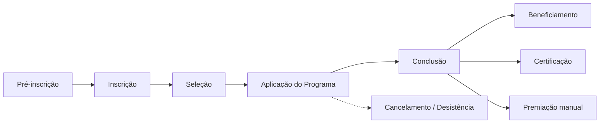
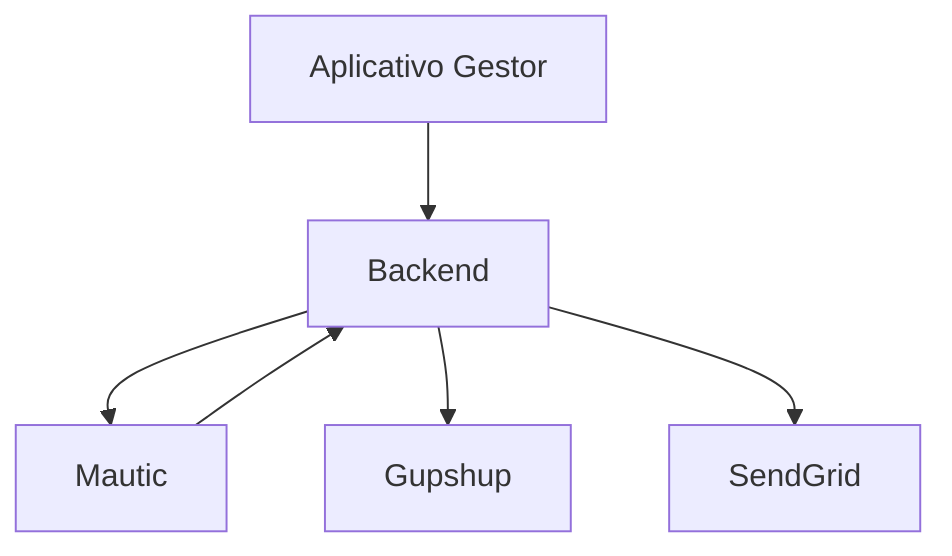
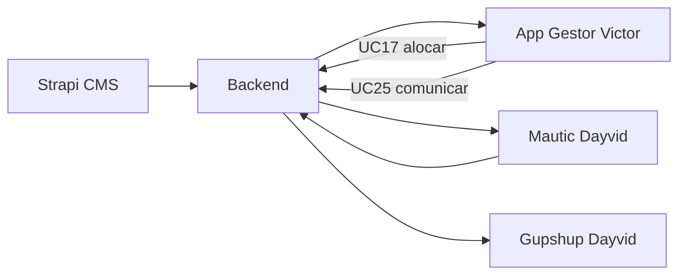

# Kick-off — Time de Desenvolvimento

**Projeto:** Sistema de Gestão de Programas Sociais — Consulado da Mulher  
**Tipo:** Reunião de alinhamento técnico (início da Fase 2)  
**Facilitador:** Alexandre Notte  
**Participantes:** Yann Jaster (Tech Lead), Dayvid Lima (Motor de automação e mensageria), Victor (Aplicativo Gestor)  
**Duração sugerida:** 90–120 min  
**Data:** _[preencher]_

---

## Objetivos da reunião

1. Alinhar visão do produto, arquitetura e responsabilidades de cada frente.
2. Apresentar documentação existente e critérios de priorização (MVP edições 2027).
3. Definir interfaces entre Backend, Mautic, Gupshup e Aplicativo Gestor.
4. Acordar próximos passos, rituais e canais de comunicação.

---

## Materiais de apoio (enviar antes)

| Documento | Para quê |
| --------- | -------- |
| [Design.md](../Design.md) | Arquitetura, domínio, ADRs, MVP |
| [Casos de Uso v3](../Casos%20de%20Uso%20-%20Consulado%20da%20Mulher_v3.md) | 75 UCs detalhados |
| [Alocacao Casos de Uso](../Alocacao%20Casos%20de%20Uso%20-%20Time%20Desenvolvimento.md) | Quem faz o quê |
| [prototipo/Aplicativo Gestor de Unidade.md](../prototipo/Aplicativo%20Gestor%20de%20Unidade.md) | Telas — gestor de unidade |
| [prototipo/Aplicativo Gestor de Turma.md](../prototipo/Aplicativo%20Gestor%20de%20Turma.md) | Telas — gestor de turma |
| [time_desenvolvimento.md](../time_desenvolvimento.md) | Equipe completa |

---

## Pauta

| # | Tópico | Tempo | Responsável |
| - | ------ | :---: | ----------- |
| 1 | Abertura e contexto do cliente | 10 min | Alexandre |
| 2 | Visão do sistema e fluxo operacional | 15 min | Alexandre |
| 3 | Arquitetura em 6 camadas e stack | 15 min | Alexandre + Yann |
| 4 | Modelo de domínio e regras transversais | 10 min | Alexandre |
| 5 | **Backend × Mautic × Gupshup** (integração crítica) | 15 min | Yann + Dayvid |
| 6 | **Aplicativo Gestor** — perfis, telas e UCs | 15 min | Victor |
| 7 | MVP vs Fase 3 e cronograma contratual | 10 min | Alexandre |
| 8 | Alocação, dependências e pontos de integração | 10 min | Todos |
| 9 | Rituais, ambientes, repositórios e próximos passos | 10 min | Yann + Alexandre |
| 10 | Dúvidas e encerramento | 10 min | Todos |

---

## Roteiro de explicação

### 1. Abertura (10 min)

**O que dizer:**

> Estamos iniciando o desenvolvimento do sistema que vai substituir planilhas e ferramentas descentralizadas do Instituto Consulado da Mulher. O público principal são **mulheres empreendedoras em vulnerabilidade social** — o acesso precisa ser simples (WhatsApp + link mágico, sem senha). Do outro lado, gestores do Consulado operam seleção, turmas, validação de entregas e indicadores.
>
> Contrato EWTI × Consulado (08.05.2026): **Fase 1** foi prototipação e requisitos; entramos na **Fase 2** (desenvolvimento, 2–4 meses) com meta de suportar **edições 2027**. Código-fonte e documentação são entregáveis contratuais.

**Destaque para todos:**

- Organização sem fins lucrativos; impacto social é critério de priorização, não só técnico.
- LGPD é requisito: segregação por unidade, CPF com HMAC-SHA256 + pepper, retenção de 5 anos.
- Princípio **80/20**: MVP primeiro; funcionalidades fora do contrato podem ser simplificadas.

---

### 2. Visão do sistema e fluxo operacional (15 min)

**O que dizer:**

> O ciclo de vida de uma participante segue este fluxo:



> **Hierarquia de dados** (memorizar — aparece em todo lugar):

```
Programa → Edição → Unidade → Turma → Participante
```

| Conceito | Resumo |
| -------- | ------ |
| **Programa** | Metodologia: tipo (online/presencial) + descrição |
| **Edição** | Instância operacional: cronogramas, módulos, unidades, meta de beneficiadas |
| **Unidade** | Regional/parceiro; empreendedora **escolhe na inscrição** |
| **Turma** | Operacionalizada pelo gestor de turma; alocação dispara jornada online |

**Status da participante:** pré-inscrita → inscrita → selecionada → em assessoria → beneficiada → certificada → contemplada (premiação) / descontinuada.

**Destaque para todos:**

- Todo registro da empreendedora exige vínculo a **programa + edição + unidade** (e **turma** quando aplicável).
- **Engajamento** = conclusão de atividade, não só visualização de vídeo.
- Premiação é **manual** (critérios textuais no CMS); ranking não contempla automaticamente.

---

### 3. Arquitetura em 6 camadas (15 min)

**O que dizer:**

> O sistema não é um monólito. São **seis camadas** com responsabilidades distintas:

| Camada | Tech | Quem na reunião |
| ------ | ---- | --------------- |
| CMS de Administração | Strapi | Alexandre (não está na call, mas alimenta todos) |
| **Aplicativo Gestor** | Next.js | **Victor** |
| Aplicativo Cliente | Next.js | Victor (+ José) — fora do escopo desta call, mas consome mesmas APIs |
| Painel BI | Dashboards | Juvenal — fora desta call |
| **Sistemas de Retaguarda (Backend)** | Node, Express, Prisma, MySQL | **Yann** (liderança) + Dayvid (integrações) |
| **Motor de Automação (Mautic)** | Mautic | **Dayvid** (integração) + Yann (APIs/webhooks) |



**Stack contratual:** Next.js, Node.js, Express, Prisma, MySQL, Strapi, AWS, Gupshup, SendGrid, Mautic, YouTube.

**Destaque para todos:**

- Frontends **só falam com o Backend** — não chamam Mautic nem Gupshup diretamente.
- Strapi modela conteúdo; Backend executa regras de negócio e integrações.
- Vídeos e lives: **YouTube** embed — não há streaming próprio.

---

### 4. Modelo de domínio e regras transversais (10 min)

**O que dizer:**

> Tipos de atividade no módulo (UC15) — o gestor e a empreendedora encontram estes tipos nas telas:

| Tipo | Destaque |
| ---- | -------- |
| Videoaula / Live | YouTube |
| Teste / Resposta aberta | Feedback sem nota ao participante |
| Tarefa de casa | Upload + **aprovação obrigatória** do gestor de turma |
| Dados financeiros mensais | Formulário recorrente + **aprovação obrigatória** |
| Presencial | QR Code + registro manual pelo gestor |
| Temporizador | Configurado no módulo; executado pelo Mautic |

**Autenticação:**

| Perfil | Mecanismo |
| ------ | --------- |
| Empreendedora | Link mágico (token ~30 dias) — **sem senha** |
| Gestores / Admin CMS | E-mail + senha |

**Segurança:**

- CPF: HMAC-SHA256 + pepper; não editável pela empreendedora após validação.
- Gestor de turma edita: e-mail, telefone, unidade (correção de alocação).

**Destaque para todos:**

- Reprovação de entrega (UC44) dispara WhatsApp + e-mail e badge de atenção no Aplicativo Cliente.
- Base legada (2015): **somente consulta** — não pré-preenche inscrição; entra em totalizadores BI.

---

### 5. Backend × Mautic × Gupshup — integração crítica (15 min)

**Facilitar:** Yann + Dayvid

**O que dizer:**

> Esta é a divisão que mais gera dúvida. **Mautic orquestra; Backend executa.**

| Responsabilidade | Backend | Mautic |
| ---------------- | ------- | ------ |
| Tokens link mágico (UC4, UC54) | ✅ | — |
| Elegibilidade, status (UC23, UC29) | ✅ | — |
| Envio WhatsApp/e-mail | ✅ via Gupshup/SendGrid | Define *quando* |
| Certificados PDF (UC55) | ✅ | Pode disparar gatilho |
| Sequência jornada online | Persiste progresso | ✅ UC33, UC52, UC53 |
| Temporizadores entre atividades | Recebe eventos | ✅ Agenda etapas |

**Fluxo online (explicar passo a passo):**

1. Gestor aloca participante na turma (UC17) — **Victor**, App Gestor.
2. Backend recebe evento e envia **webhook ao Mautic** — **Yann/Dayvid**.
3. Mautic agenda etapas conforme módulo + temporizadores — **Dayvid**.
4. Para cada etapa, Mautic aciona Backend — **Yann**.
5. Backend gera link mágico (UC54) e chama Gupshup (UC49/51) — **Dayvid**.
6. Empreendedora clica, entra no Aplicativo Cliente autenticada — fora desta call, mas mesma API.

**Programas presenciais:** Mautic não orquestra; gestor de turma define sequência no App Gestor (UC34).

#### Para Yann Jaster (Tech Lead)

- Liderança das **APIs** e regras de negócio no Backend.
- UCs principais como RP: UC23 (elegibilidade), UC29 (status), UC55 (certificados).
- Apoio/revisão em UC33, UC52, UC53 com Dayvid.
- Definir **padrões**: estrutura de repositórios, contratos de API (OpenAPI), autenticação gestor, testes, code review.
- Ponto de integração com **Victor**: contratos REST que o App Gestor consome; erros, paginação, filtros por unidade/turma.
- Coordenar com **Mateus** (infra): ambientes dev/staging/prod, variáveis de ambiente, secrets (Gupshup, SendGrid, pepper CPF).

**Perguntas para alinhar com Yann:**

- Monorepo ou repositórios separados (gestor / api / mautic)?
- Estratégia de filas (Bull, SQS?) para disparos assíncronos.
- Onde vive a lógica de permissões — middleware no Backend por perfil/unidade/turma?

#### Para Dayvid Lima (Motor de automação e mensageria)

- **Mautic:** instalação, campanhas, gatilhos, webhooks bidirecionais com Backend (UC33, UC52, UC53).
- **Gupshup:** templates Meta, envio individual (UC49), mídia (UC51), retry em falha.
- **UC50 (grupo WhatsApp):** facilitador manual no App Gestor — **não** usa Gupshup; clipboard + link do grupo (UC16/UC66).
- **SendGrid:** e-mail transacional e links mágicos.
- **Filas e processamento assíncrono** — disparos em lote (ex.: UC25 comunicação de seleção acionada pelo gestor).
- UCs como RP: UC25, UC49–UC51, UC54; apoio forte em UC4 (geração de token no Backend — alinhar com Yann).

**Perguntas para alinhar com Dayvid:**

- Mautic self-hosted na AWS ou serviço gerenciado?
- Contrato de webhook: payload quando participante é alocada em turma (UC17).
- Como Mautic referencia participante — ID interno, hash CPF, external ID?
- Rate limits Gupshup e estratégia de dead-letter em falhas.

#### Para todos neste bloco

- **Nunca** acoplar regra de negócio dentro do Mautic além de orquestração temporal.
- Victor precisa de API clara para: disparar comunicação manual (UC25, UC49–51) e saber status de envio.
- Documentar contratos de integração em ADR ou README de `api/integrations`.

---

### 6. Aplicativo Gestor — perfis, telas e UCs (15 min)

**Facilitar:** Victor

**O que dizer:**

> Um único app Next.js, **dois perfis operacionais** com menus distintos. Login e-mail/senha (UC3). Protótipos já documentados em dois arquivos consolidados.

#### Gestor de Unidade

Visão sobre **todas as turmas da unidade**.

| Tela | UCs | Prioridade |
| ---- | --- | ---------- |
| Dashboard unidade | UC59 (resumo) | MVP |
| Seleção de participantes | UC24 | MVP |
| Comunicar resultado seleção | UC25 | MVP — dispara Dayvid/Gupshup |
| Histórico participação | UC28 | MVP |
| Ranking e engajamento | UC56 | Fase 3 |
| Registrar premiação | UC57 | MVP |
| Capital semente | UC58 | Fase 3 |
| Registrar mentoria | UC70 | MVP |

#### Gestor de Turma

Operação **da turma**: validação, presencial, participantes.

| Tela | UCs | Prioridade |
| ---- | --- | ---------- |
| Dashboard turma | — | MVP |
| Turmas (CRUD) | UC16 | MVP |
| Alocar em turma | UC17 | MVP — **gatilho Mautic** |
| Transferir turma | UC18 | MVP |
| Detalhe / editar participante | UC27, UC42 | MVP |
| Inserir dados em nome | UC69 | MVP |
| Cancelamento/desistência | UC30 | MVP |
| Negócios | UC31, UC32 | MVP |
| Sequência e presenciais | UC34, UC35 | MVP |
| Presença (QR + manual) | UC40, UC41 | MVP |
| Fila de aprovações | UC44, UC46 | MVP |
| Comunicação WhatsApp | UC49–51 | MVP |
| Mini CRM leads | UC26 | Fase 3 |

#### Para Victor (Aplicativo Gestor)

- RP de **~20 UCs** do App Gestor (ver [Alocação](../Alocacao%20Casos%20de%20Uso%20-%20Time%20Desenvolvimento.md)).
- Next.js App Router; **mobile-first** também para gestores em campo.
- Segregação LGPD: toda query filtrada por unidade/turma do gestor logado — **não confiar só no front**.
- Telas críticas para integração:
  - **UC17** alocar → POST que dispara webhook Mautic.
  - **UC25/49–51** comunicação → APIs Dayvid; UI de preview e histórico de envio.
  - **UC44** aprovações → fila com estados: pendente, aprovado, reprovado, reenvio.
- Apoio de **José** no front-end; revisão de **Yann** em chamadas de API e estrutura.
- Reutilizar componentes entre perfis (tabelas, filtros, modais) com menus condicionais.

**Perguntas para alinhar com Victor:**

- Auth: JWT + refresh? Sessão server-side? Integração com roles do Strapi/CMS?
- Estado global (React Query / Zustand) para edição/unidade/turma selecionada.
- Como tratar gestor com **duplo perfil** (unidade + turma) na mesma conta?

#### Para Yann e Dayvid (o que Victor precisa de vocês)

| Necessidade do Gestor | API / evento |
| -------------------- | ------------ |
| Listar inscrições elegíveis (UC24) | `GET /inscricoes?edicao=&unidade=&elegibilidade=` |
| Confirmar seleção | `POST /selecao` |
| Comunicar seleção (UC25) | `POST /comunicacao/selecao` → fila Gupshup |
| Alocar turma (UC17) | `POST /turmas/:id/participantes` → webhook Mautic |
| Fila aprovações (UC44) | `GET /entregas?status=pendente` + `PATCH /entregas/:id` |
| Disparo WhatsApp manual | `POST /mensagens/whatsapp` |
| Presença QR | `POST /presenca` + geração QR `GET /encontros/:id/qr` |

---

### 7. MVP vs Fase 3 e cronograma (10 min)

**O que dizer:**

> Meta: **edições 2027**. Nem os 75 UCs entram no primeiro release.

**MVP (essencial):** UC1–UC18, UC19–UC26 (exceto mini CRM), UC27–UC45, UC49–UC55, UC59–UC60, UC66.

**Fase 3 / evolução:** UC26 (Mini CRM), UC51 (vídeo WhatsApp avançado), UC56–UC58, UC63–UC65, UC64 (Chat IA), UC67–UC75.

**Ordem sugerida de desenvolvimento (discutir):**

| Sprint / marco | Entregável |
| -------------- | ---------- |
| M0 | Ambientes, repos, CI/CD, esqueleto API + App Gestor |
| M1 | Auth gestor, CMS básico (programa/edição/unidade), inscrição pública |
| M2 | Seleção + alocação turma + integração Mautic mínima |
| M3 | Jornada online (1 módulo piloto), link mágico, Gupshup |
| M4 | Aprovações, presencial, dados financeiros |
| M5 | Certificação, BI básico, homologação |

**Destaque para todos:**

- UC67 (localStorage retomada), UC64 (chat IA), UC56–UC58 podem esperar.
- 2FA (UC6): contrato prevê, mas **não bloqueia MVP operacional**.

---

### 8. Alocação, dependências e integração (10 min)

**Matriz de dependências (resumida):**



| De | Para | Dependência |
| -- | ---- | ----------- |
| Victor | Yann | Contratos API, auth, modelos de dados |
| Victor | Dayvid | Status de envio WhatsApp, erros Gupshup |
| Dayvid | Yann | Webhooks, IDs de participante, endpoints de token |
| Yann | Alexandre | Modelo de dados Prisma, entidades Strapi |
| Todos | Mateus | Ambientes e deploy |
| Todos | Eduardo | Design system e telas (paralelo) |

**Acordos a fechar na reunião:**

- [ ] Canal principal (Slack/Teams/WhatsApp) e reunião semanal de sync técnica
- [ ] Repositório(s) e branch strategy (`main`, `develop`, feature branches)
- [ ] Onde documentar contratos de API (Swagger, Notion, repo)
- [ ] Quem aprova PRs de cada frente

---

### 9. Próximos passos imediatos (10 min)

| Ação | Responsável | Prazo sugerido |
| ---- | ----------- | -------------- |
| Validar diagrama de integração Backend ↔ Mautic ↔ Gupshup | Yann + Dayvid | 1 semana |
| Esboço OpenAPI v0 (auth, participantes, turmas, mensagens) | Yann | 1 semana |
| Setup Mautic em ambiente dev + webhook de teste | Dayvid | 1–2 semanas |
| Scaffold App Gestor (login, layout, rotas por perfil) | Victor | 1 semana |
| Alinhar com Mateus ambientes AWS e variáveis | Yann | 1 semana |
| Review protótipos Gestor com Eduardo (UI) | Victor | contínuo |

---

### 10. Encerramento — checklist de compreensão

Pedir que cada um resuma em uma frase sua frente:

| Participante | Esperado |
| ------------ | -------- |
| **Yann** | "APIs e regras de negócio no Backend; contratos para Gestor e Mautic; revisão técnica." |
| **Dayvid** | "Mautic orquestra jornada online; Backend executa envios Gupshup/SendGrid e tokens." |
| **Victor** | "App Gestor Next.js com dois perfis; consumo das APIs; UC17 e UC44 são críticos." |

**Dúvidas em aberto** — registrar abaixo:

| # | Pergunta | Dono | Resposta |
| - | -------- | ---- | -------- |
| 1 | | | |
| 2 | | | |
| 3 | | | |

---

## Anexo — Referência rápida de UCs por participante

### Yann Jaster (RP principal)

UC23, UC29, UC33 (com Dayvid), UC52, UC53, UC55 + revisão transversal

### Dayvid Lima (RP principal)

UC25, UC49, UC51, UC54, UC65 + Mautic (UC33, UC52, UC53)

**Nota:** UC50 (grupo WhatsApp) é facilitador manual no App Gestor (Victor) — não passa por Dayvid/Gupshup.

### Victor (RP principal — App Gestor)

UC3, UC16–UC18, UC24–UC32, UC34–UC35, UC41–UC42, UC44, UC46, UC50, UC57, UC69–UC70

---

## Anexo — Glossário para a reunião

| Termo | Significado |
| ----- | ----------- |
| **Link mágico** | URL com token de sessão; login da empreendedora sem senha |
| **Edição** | Instância anual/semestral de um programa |
| **Unidade** | Agrupamento regional; escolhida na inscrição |
| **Turma** | Grupo operacional; gestor de turma valida entregas |
| **Gupshup** | Provedor WhatsApp Business API |
| **Mautic** | Motor de automação de campanhas e temporizadores |
| **Engajamento** | Conclusão de atividade (não só view de vídeo) |
| **Beneficiada** | Participante que cumpriu critérios do programa (UC13) |

---

_Ata a preencher após a reunião._
